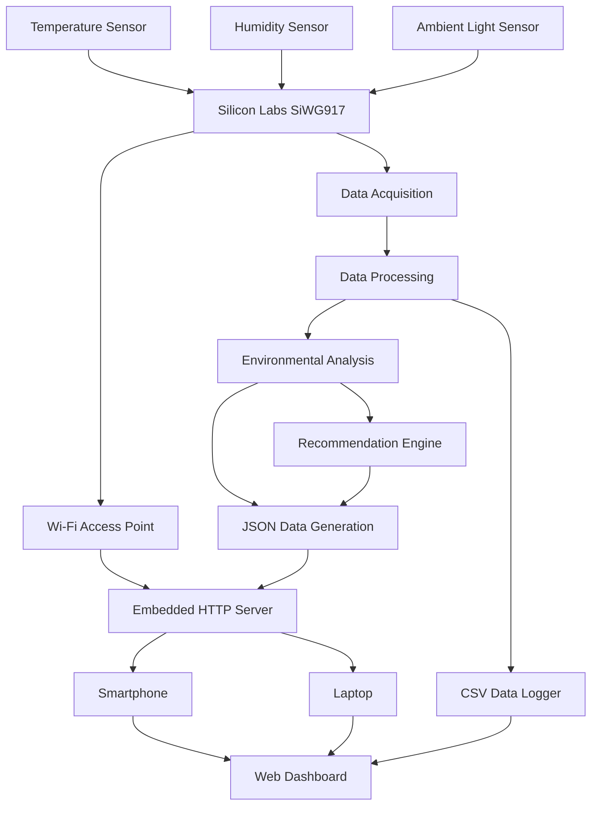
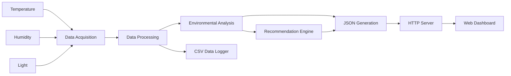
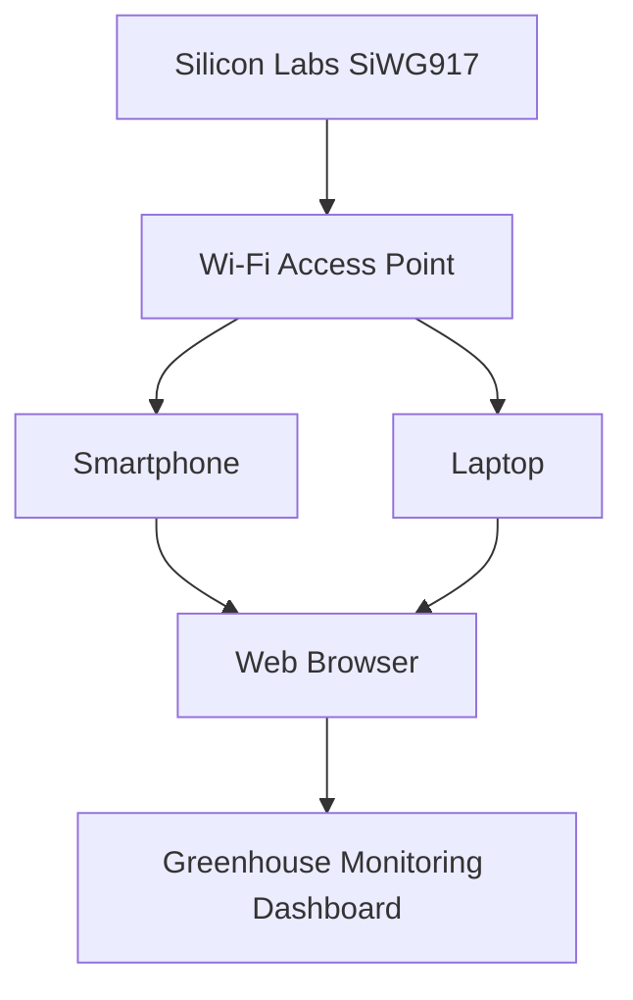
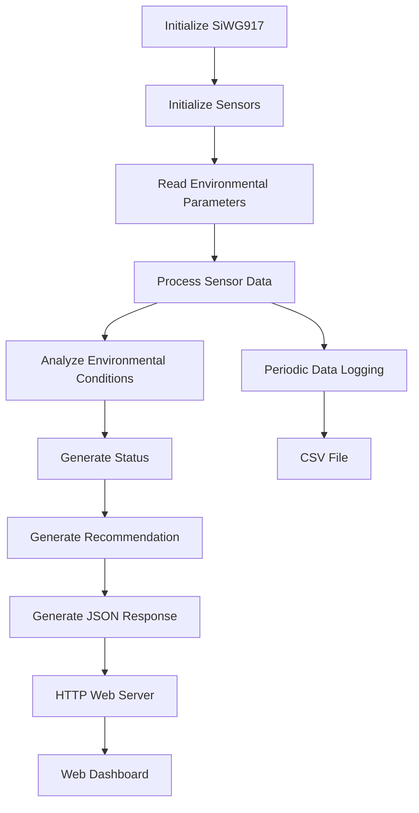

# Centre of Innovation in IoT Project

# IoT Enabled Greenhouse Environmental Monitoring System with Integrated Wireless Gateway using Silicon Labs SiWG917

## 1. Project Overview

The **IoT Enabled Greenhouse Environmental Monitoring System** is a standalone environmental monitoring solution developed using the **Silicon Labs SiWG917 Wireless MCU**.

The system is designed to monitor important greenhouse parameters such as:

* Temperature
* Relative humidity
* Ambient light intensity

The SiWG917 collects sensor data, processes it locally, analyzes the environmental conditions, and generates recommendations based on predefined thresholds.

The device operates as a **Wi-Fi Access Point** and hosts an embedded **HTTP web server**. Users can connect directly to the SiWG917 using a smartphone or laptop and monitor the greenhouse through a web-based dashboard.

The system does not require cloud services, MQTT, an external gateway, or a database. Historical sensor readings can also be stored and downloaded in **CSV format** for analysis and record keeping.

### Objectives

* Monitor greenhouse temperature.
* Monitor relative humidity.
* Monitor ambient light intensity.
* Process sensor data locally.
* Analyze environmental conditions.
* Generate environmental status information.
* Generate recommendations for improving greenhouse conditions.
* Configure SiWG917 as a Wi-Fi Access Point.
* Host an embedded HTTP web server.
* Provide a browser-based monitoring dashboard.
* Enable CSV data logging and download.
* Minimize dependency on external infrastructure.

---

## 2. Technical Architecture

### 2.1 System Architecture

### 2.2 Data Flow

### 2.3 Wireless Communication

### 2.4 System Working Flow

---

## 3. Technologies Used

### Wireless Technologies

* **Wi-Fi**
* Wi-Fi Access Point mode
* Local wireless communication between SiWG917 and user devices

### Silicon Labs Platform

* **Silicon Labs SiWG917 Wireless MCU**
* Silicon Labs SiWG917 Development Kit
* Silicon Labs SDK
* Silicon Labs Wi-Fi software components
* Embedded HTTP server components

### Programming Languages

* **C** – Embedded firmware development
* **HTML** – Web dashboard
* **CSS** – Web dashboard styling
* **JavaScript** – Web dashboard functionality
* **JSON** – Sensor data exchange
* **CSV** – Historical data storage

### Software Functions

* Sensor data acquisition
* Environmental data processing
* Environmental condition analysis
* Threshold-based recommendation generation
* Wi-Fi Access Point operation
* Embedded HTTP server
* JSON data generation
* CSV data logging
* Browser-based dashboard

### Development Tools

* Silicon Labs Simplicity Studio
* Silicon Labs SDK
* Visual Studio Code
* Git
* GitHub
* Web browser

---

## 4. Hardware Components

### Silicon Labs Hardware

| Component                                | Purpose                                                           |
| ---------------------------------------- | ----------------------------------------------------------------- |
| **Silicon Labs SiWG917 Development Kit** | Main controller and wireless gateway                              |
| **SiWG917 Wireless MCU**                 | Sensor processing, Wi-Fi communication, and HTTP server operation |
| **Onboard Temperature Sensor**           | Temperature monitoring                                            |
| **Onboard Humidity Sensor**              | Relative humidity monitoring                                      |
| **Onboard Light Sensor**                 | Ambient light monitoring                                          |

### External Hardware

| Component                             | Purpose                                                      |
| ------------------------------------- | ------------------------------------------------------------ |
| **USB Cable**                         | Power supply and programming                                 |
| **Laptop / PC**                       | Firmware development and system configuration                |
| **Smartphone / Wi-Fi-enabled device** | Connect to the SiWG917 Access Point and access the dashboard |

The current implementation does not require an external gateway such as a Raspberry Pi.

---

## 7. Software Components / Dependencies

### Silicon Labs Dependencies

| Dependency                    | Purpose                                                     |
| ----------------------------- | ----------------------------------------------------------- |
| **SiWG917 SDK**               | Firmware development for the SiWG917                        |
| **Simplicity Studio**         | Project development, configuration, flashing, and debugging |
| **Wi-Fi Software Components** | Wi-Fi Access Point functionality                            |
| **HTTP Server Components**    | Embedded web-server functionality                           |
| **Sensor Drivers / APIs**     | Communication with the onboard sensors                      |

### Version Information

| Component             | Version                           |
| --------------------- | --------------------------------- |
| **Silicon Labs SDK**  | `<ADD_USED_VERSION>`              |
| **Simplicity Studio** | `<ADD_USED_VERSION>`              |
| **Reference Example** | `<ADD_REFERENCE_EXAMPLE_IF_USED>` |

> Replace the placeholders above with the exact versions used to develop and test the project.

### External Software Dependencies

The project does not require cloud services, MQTT brokers, or external databases.

Development and access may require:

* Visual Studio Code
* Git
* GitHub
* Modern web browser

---

## 8. Licensing

This project is released under the **Apache License 2.0**.

The complete license text is available in the [`LICENSE`](LICENSE) file.

Third-party software, SDKs, libraries, and other components used by the project remain subject to their respective licenses.

### Third-Party License Considerations

* Silicon Labs SDK and software components are subject to their respective Silicon Labs licensing terms.
* Any third-party libraries included in the project must retain their original license and copyright notices.
* Third-party source code should be identified separately in accordance with its license requirements.

> **Note:** Confirm the officially required license for the COI submission before finalizing this section.

---

## 9. Maintainers / Contacts

| Name               | Role                           | Contact Information                                 | GitHub Profile                            |
| ------------------ | ------------------------------ | --------------------------------------------------- | ----------------------------------------- |
## 9. Maintainers / Contacts
| Name           | Role      | Contact Information             |
| -------------- | --------- | ------------------------------- | 
| Ragavappranesh S | Team Lead | ragavpranesh1@gmail.com          |
| Shri Soumitra KS  | Developer | soumitrakouselya2006@gmail.com       | 
| Srinidhi M     | Developer | srinidhimurugesan004@gmail.com  | 
| Ragadharshini S       | Developer | ragadharshinisampath25@gmail.com        |          
| MARUFU ALLISON   | Developer | 23ec064@kpriet.ac.in     | 
