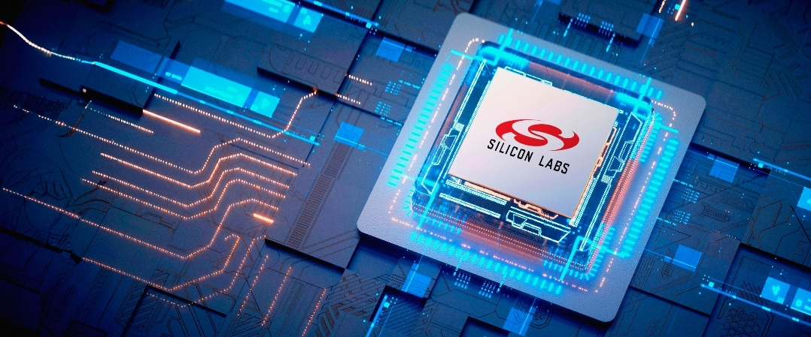

# Summary of the Program

Silicon Labs is partnering with universities to establish Centres of Innovation in IoT, designed to accelerate the development of industry-ready engineering talent. Through this initiative, Silicon Labs equips academic institutions with modern hardware, software tools, training assets, and structured learning experiences that mirror real-world product development environments. The goal is to close the skills gap in emerging technologies—particularly wireless connectivity, intelligent systems, and automation—by embedding practical, application-driven engineering capabilities directly into the academic setting.

Each Innovation Centre is built as a dedicated lab space that supports hands-on learning using Silicon Labs development kits, Simplicity Studio software, and curated training content. Faculty receive guidance on industry practices, enabling them to mentor students effectively as they progress from basic experimentation to full product creation. Students engage in end-to-end solution development: defining use cases, designing hardware and software, validating performance, and refining for power, cost, and reliability. Silicon Labs experts supplement this journey through annual training sessions, ongoing online support, and technical input on project scoping and execution.

The program ultimately serves as a launchpad for innovation, entrepreneurship, and workforce development. Students gain experience in building advanced IoT applications and are encouraged to produce market-ready prototypes rather than academic-only projects. High-quality student work may be showcased on Silicon Labs’ global platforms, providing visibility to potential employers and industry partners. Institutions benefit from strengthened industry linkage, enhanced research infrastructure, and improved student employability, while startups on campus gain access to technical support.

This collaboration ensures that universities become hubs for next-generation engineering capability, aligning academic outcomes with industry needs and preparing students for impactful careers in the rapidly evolving electronics and IoT sectors.
